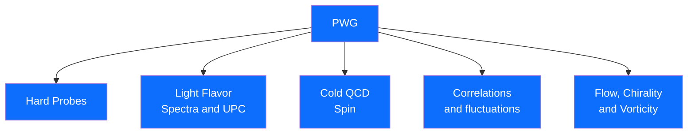
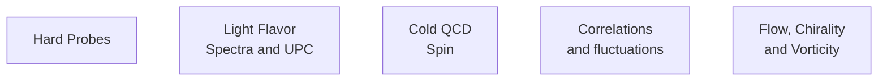

# STAR Main Web Sites

<!--

[Timetable for current collaboration meeting](https://drupal.star.bnl.gov/STAR/conference/timetable/talk/70578){: .btn .btn-green }

-->

{: .highlight }
April 2025 - STAR moved to new Alma 9 nodes (`starsub0x`) instead of SL7 (`rcas60xx`). Check [instruction](/software/a9)

[star.bnl.gov](https://www.star.bnl.gov/){: .btn .btn-blue }

[Mattermost](https://chat.sdcc.bnl.gov){: .btn .btn-blue }

[Drupal computing](https://drupal.star.bnl.gov/STAR/comp/){: .btn .btn-blue }

[Chatbot](https://starchat.streamlit.app/){: .btn .btn-blue }

[Run Page](https://online.star.bnl.gov/){: .btn .btn-blue }

## Weekly meetings

## Mailing lists

[starmail](https://lists.bnl.gov/sympa/arc/starmail-l){: .btn .btn-purple}

[star-talks](https://lists.bnl.gov/sympa/arc/star-talks-l){: .btn .btn-purple }

[star-juniors](https://lists.bnl.gov/sympa/arc/starjuniors-l/){: .btn .btn-purple }

[starsoft](https://lists.bnl.gov/sympa/arc/starsoft-l/){: .btn .btn-purple }

# Learn About STAR Detectors

## Event Display

Interactive displays for visualization of STAR detectors in action. These tools offer zooming and dynamic viewing angles to help understand detector operations:

- [STAR interactive detectors](https://nsww.org/projects/bnl/star/sub-systems.php)
- [STAR live event display](https://online.star.bnl.gov/aggregator/livedisplay/)
- [Dmitry's event display](https://www.star.bnl.gov/~dmitry/edisplay/)

## Detector Expert's Presentations

Informative talks and videos from Junior Meetings, providing insights into specific detectors:

- [Time Projection Chamber (TPC)](https://drupal.star.bnl.gov/STAR/event/2020/06/11/star-juniors-detector-meeting-tpc) (Gene Van Buren, June 2020)

- [Event Plane Detector (EPD)](https://drupal.star.bnl.gov/STAR/event/2020/02/20/star-juniors-detector-meeting-epd) (Mike Lisa, February 2020 [youtube](https://youtu.be/OfJTq5cFe4U))

- [Barrel Electromagnetic Calorimeter and Barrel Shower Maximum Detector (BEMC)](https://drupal.star.bnl.gov/STAR/meetings/star-collaboration-meeting-september-2020/juniors-day/star-barrel-calorimeter-and-shower-ma) (Stephen Trentalange, September 2020 - [pdf](https://drupal.star.bnl.gov/STAR/system/files/TOFatJuniorsDay2021.pdf) )

- [Time of Flight Detector (TOF)](https://drupal.star.bnl.gov/STAR/meetings/star-collaboration-meeting-march-2021/juniors-day/stars-time-flight-detector) (Frank Geurts, March 2021)

### NIM Papers - each subdetector paper

Deep dive into technical papers on STAR detectors:

- [NIM papers for all STAR detectors](https://www.star.bnl.gov/public/tpc/NimPapers/index.htm)
- [STAR PID NIM Paper](https://arxiv.org/abs/nucl-ex/0505026v2)

# Learn About STAR Data Analysis

### DST tutorials

- [Introduction to PicoDst](https://drupal.star.bnl.gov/STAR/system/files/Nigmatkulov_intro2pico_Krakow2019.pdf) (Grigory Nigmatkulov, 2019)
- Introduction to MuDst:
  - [A common-MuDst tutorial](https://www.star.bnl.gov/public/comp/meet/RM200311/MuDstTutorial.pdf) (Sergey Panitkin, 2003)
  - [Starting Data Analysis on STAR](http://nuclear.ucdavis.edu/~brovko/GettingStarted.pdf) (Samantha Brovko, 2011)

### Basic STAR analysis

- [Basics of a STAR analysis](https://drupal.star.bnl.gov/STAR/system/files/Upsal_JuniorsDay.pdf) + [source](https://drupal.star.bnl.gov/STAR/meetings/star-collaboration-meeting/afternoon-session/star-software-101) (Isaac Upsal, 2019)
- [My experience of data analysis at STAR](https://drupal.star.bnl.gov/STAR/system/files/RMa_ColMetg_Junior.pdf) (Rongrong Ma, 2018)
- [Introduction to STAR software and makers 2015](https://nsww.org/projects/bnl/star/docs/STAR_soft_BNL_LK_2015_6_1.pdf) + [updated 2023](https://indico.fjfi.cvut.cz/event/218/contributions/3889/attachments/1253/1936/STAR_soft_LK_2023_2_17.pdf) (Leszek Kosarzewski,2023)

### STAR scheduler  

- [The STAR scheduler](https://drupal.star.bnl.gov/STAR/system/files/The_STAR_Scheduler_V8.pdf) (Levente Hajdu, 2019)
- [SUMS(aks STAR scheduler) and Condor Drupal page](https://drupal.star.bnl.gov/STAR/comp/sofi/batch#Condor)
- [Manual](https://www.star.bnl.gov/public/comp/Grid/scheduler/manual.htm)
- [STAR Scheduler tutorial](https://drupal.star.bnl.gov/STAR/event/2022/01/14/Scheduler-tutorial/Scheduler-Tutorial) (Levente Hajdu, Jerome Lauret, January 2022)

### Starsim

- [STAR Simulation Page](https://www.star.bnl.gov/public/comp/simu/newsite/) (looks old but has some useful info)
- [Drupal STAR Simulation Framework](https://drupal.star.bnl.gov/STAR/comp/simu/star-simulation-framework) (looks unfinished but still useful)

### Other

- CVS in STAR
 [https://drupal.star.bnl.gov/STAR/comp/sofi/tutorials/cvs](https://drupal.star.bnl.gov/STAR/comp/sofi/tutorials/cvs)

- FileCatalog `get_file_list.pl` [https://drupal.star.bnl.gov/STAR/comp/sofi/filecatalog/user-manual](https://drupal.star.bnl.gov/STAR/comp/sofi/filecatalog/user-manual)

# Selected Junior Meetings on physics

- [Relativistic hydrodynamics for heavy ion collisions](https://drupal.star.bnl.gov/STAR/event/2020/06/17/star-juniors-meeting-hydrodynamical-evolution) (Iurii Karpenko, June 2020)
- [Handling Systematic Errors](https://drupal.star.bnl.gov/STAR/meetings/star-collaboration-meeting-march-2021/juniors-day/handling-systematic-errors) (Roger Barlow, March 2021)
- [STAR Embedding](https://drupal.star.bnl.gov/STAR/meetings/star-collaboration-meeting-march-2021/juniors-day/star-embedding-tutorial) (Xianglei Zhu, March 2021)
- [Correlations at the femtoscopic scale](https://drupal.star.bnl.gov/STAR/meetings/star-collaboration-meeting-september-2021/juniors-day/correlations-femtoscopic-scale) (Hanna Zbroszczyk, September 2021)
- [Uproot and Awkward Array tutorial](https://drupal.star.bnl.gov/STAR/meetings/star-collaboration-meeting-september-2021/juniors-day/uproot-and-awkward-array-tutorial-par) (Jim Pivarski, September 2021)

- [Jets at RHIC](https://drupal.star.bnl.gov/STAR/meetings/STAR-Collaboration-Meeting-February-2022/Junior-Day/TBD-1) (Saehanseul Oh, February 2022)
- [CME primer and lessons from Isobar Run](https://drupal.star.bnl.gov/STAR/meetings/STAR-Collaboration-Meeting-February-2022/Junior-Day/CME-primer-and-what-we-learned-isobar-r) (Evan Finch, February 2022)
- [QCD Phase Structure at finite baryon density](https://drupal.star.bnl.gov/STAR/meetings/STAR-Collaboration-Meeting-February-2022/Junior-Day/QCD-phase-structure-finite-baryon-densi) (Volodymyr Vovchenko, February 2022)
- [STAR Forward Upgrade](https://drupal.star.bnl.gov/STAR/meetings/STAR-Collaboration-Meeting-February-2022/Junior-Day/TBD-2) (Carl Gagliardi, February 2022)
- [Simulations at STAR](https://drupal.star.bnl.gov/STAR/meetings/STAR-Collaboration-Meeting-Spring-2023/Juniors-Day/Getting-started-simulations-STAR) (Jason Webb, February 2023)
- [Publishing your STAR result](https://drupal.star.bnl.gov/STAR/meetings/STAR-Collaboration-Meeting-Spring-2023/Juniors-Day/TBD-How-write-paper) (Mike Lisa, February 2023)
- [Neutron star mergers](https://drupal.star.bnl.gov/STAR/meetings/STAR-Collaboration-Meeting-Spring-2023/Juniors-Day/TBD-Neutron-star-mergers) (Wenbin Lu, February 2023)
- [Nucleon structure](https://drupal.star.bnl.gov/STAR/meetings/STAR-Collaboration-Meeting-Spring-2023/Juniors-Day/Studies-nucleon-structure-STAR) (Xiaoxuan Chu, February 2023)

# Additional Resources

- [STAR Theses](https://drupal.star.bnl.gov/STAR/theses) — Collection of STAR theses with detailed detector insights.
- [STAR Notes Drupal Page](https://drupal.star.bnl.gov/STAR/starnotes) — Access technical notes and internal documents.
- [Presentations](https://drupal.star.bnl.gov/STAR/presentations/) — abstracts / talks / posters / proceedings
- [Real Data Summary Production](https://www.star.bnl.gov/public/comp/prod/ProdList.html) — Overview of data production summaries.
- [BFC Production Options](https://www.star.bnl.gov/devcgi/dbProdOptionRetrv.pl) — Configurations for dst, [git](https://github.com/star-bnl/star-sw/blob/main/StRoot/StBFChain/StBFChain.cxx)
- [Disc Quota and Usage Status](https://monitoring.sdcc.bnl.gov/Facility/GCE/GPFS/) — monitoring GPFS
- [GPC Information](https://www.star.bnl.gov/protected/common/GPCs/gpc-committees.xml) — `.xml` file with all details on God-Parent Committees  (GPC).
- [STAR Github Repository](https://github.com/star-bnl)

<!-- [https://drupal.star.bnl.gov/STAR/system/files/userfiles/6359/STAR_Juniors_Intro-3.pdf](https://drupal.star.bnl.gov/STAR/system/files/userfiles/6359/STAR_Juniors_Intro-3.pdf) -->

<!-- The webpage was inspired by [UCR RHIC's GitHub Page](https://github.com/ucr-rhic/ucr-rhic.github.io/) -->
