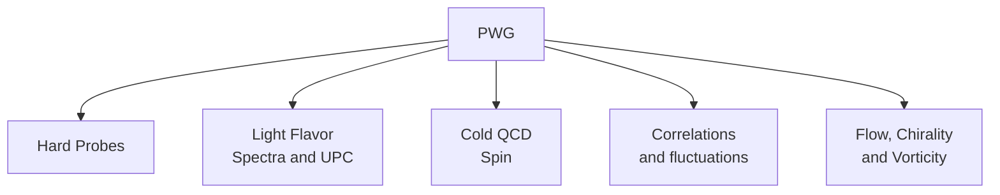

# STAR Juniors Intro Manual

## Contents

1. [Introduction](#introduction)
2. [SDCC](#sdcc)
   - [Running your analysis](#running-your-analysis)
3. [Publishing Analysis](#publishing-analysis)
4. [Physics Working Groups](#physics-working-groups)
5. [Mattermost channels](#mattermost-channels)
6. [STAR Collaboration Meetings](#star-collaboration-meetings)
7. [STAR Mailing Lists](#star-mailing-lists)

## Introduction

Welcome to STAR! This manual is intended to help STAR juniors who have just entered the collaboration. The manual covers various topics and materials needed to start your analysis and navigate SDCC.

## SDCC

Once you have obtained your life number and other credentials, you can use them to log in to SDCC. To obtain these credentials, visit this link and follow the steps:  
<https://drupal.star.bnl.gov/STAR/comp/sofi/facility-access/general-access>

### Basic Commands for Logging in

```bash
ssh -AX xxx@sssh.sdcc.bnl.gov
rterm -i
```

Replace `xxx` with your username. You will be prompted for a password, which corresponds to your local PC credentials. Upon running `rterm`, enter your SDCC password.

However, it is highly recommended to use SSH keys folling tutorial [here](/software/ssh/)

### Running Your Analysis

To run your analysis, set up preliminary files. Here are some useful tutorials:

- Set up your environment on SDCC:  
  <https://drupal.star.bnl.gov/STAR/system/files/STAR_soft_BNL_LK_2015_6_1.pdf>
- Data analysis:  
  <https://drupal.star.bnl.gov/STAR/system/files/RMa_ColMetg_Junior.pdf>
- Scheduler tutorial:  
  <https://www.star.bnl.gov/public/comp/Grid/scheduler/manual.htm>
- Data availability:  
  <https://www.star.bnl.gov/public/comp/prod/localdata/DDpicosize.html>

Use interactive sessions only for testing macros. Submit jobs to the farm for more computational resources.

## Publishing Analysis

STAR Papers are documented with analysis notes. Find them here:

- STAR analysis notes:  
  <https://drupal.star.bnl.gov/STAR/starnotes>
- Published analyses:  
  <https://www.star.bnl.gov/cgi-bin/protected/viewvc.cgi/cvsroot/offline/paper/>

Additional resources:

- List of God Parent Committees:  
  <https://www.star.bnl.gov/protected/common/GPCs/gpc-committees.xml>
- Publication steps:  
  <https://drupal.star.bnl.gov/STAR/system/files/20220916_PACreport.pdf>
- Author tools:  
  <https://www.star.bnl.gov/central/collaboration/authors/>

## Physics Working Groups

STAR has 5 PWGs for collaborative analysis. Find meeting links and past agendas here:

- PWG meetings:  



- Events:  
  <https://drupal.star.bnl.gov/STAR/event>

## Mattermost Channels

Join the Mattermost channels to ask questions and get help from experts:

- Juniors:  
  <https://chat.sdcc.bnl.gov/star/channels/star-juniors>
- Software and infrastructure:  
  <https://chat.sdcc.bnl.gov/star/channels/star-software-and-infrastructure>
- Town square:  
  <https://chat.sdcc.bnl.gov/star/channels/town-square>
- Job running:  
  <https://chat.sdcc.bnl.gov/star/channels/scheduler>

## STAR Collaboration Meetings

Collaboration meetings occur twice a year, starting with Junior Days. Access past Junior Days materials here:

- Past Junior Days:  
  <https://drupal.star.bnl.gov/STAR/juniors/past-juniors-days>
- Junior Education Materials:  
  <https://drupal.star.bnl.gov/STAR/juniors/educational-materials>

## STAR Mailing Lists

Subscribe to mailing lists for updates on recent events:  
<https://lists.bnl.gov/mailman/listinfo>
