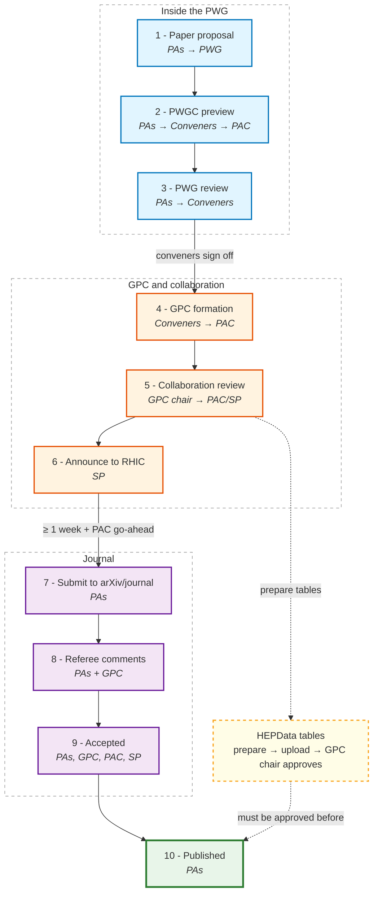
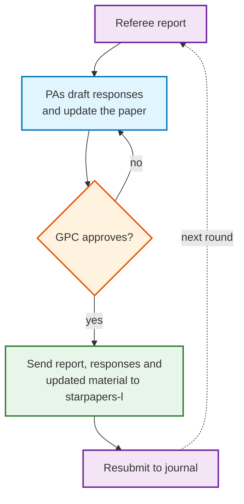
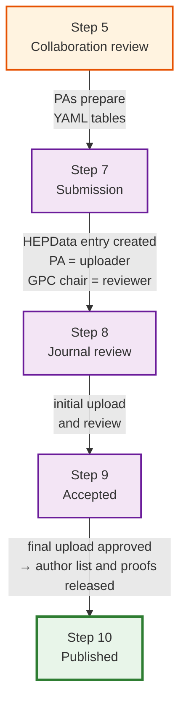

# STAR Paper Publication Procedure

Steps of the STAR paper publication procedure, from the paper proposal to the published paper.

- [STAR Paper Publication Procedure](https://drupal.star.bnl.gov/STAR/pwg/common/STAR-Paper-Publication-Procedure)
- [STAR Publication and Presentation Policy](https://drupal.star.bnl.gov/STAR/system/files/PublicationPolicy101613_v2.html)

Abbreviations: PA - Principal Author, PWG - Physics Working Group, PWGC - PWG Conveners, PAC - Physics Analysis Coordinators, GPC - God-Parent Committee, SP - Spokesperson.

## Table of Contents

- [Overview](#overview)
- [Time frames](#time-frames)
- [Step 1: Paper proposal to PWG](#step-1-paper-proposal-to-pwg)
- [Step 2: PWGC preview](#step-2-pwgc-preview)
- [Step 3: PWG review](#step-3-pwg-review)
- [Step 4: GPC formation](#step-4-gpc-formation)
- [Step 5: Collaboration review](#step-5-collaboration-review)
- [Step 6: Announce the paper to RHIC](#step-6-announce-the-paper-to-rhic)
- [Step 7: Submit to arXiv and journal](#step-7-submit-to-arxiv-and-journal)
- [Step 8: Address referee comments](#step-8-address-referee-comments)
- [Step 9: Paper accepted for publication](#step-9-paper-accepted-for-publication)
- [Step 10: Paper published](#step-10-paper-published)
- [HEPData process](#hepdata-process)
- [Useful links](#useful-links)

## Overview

### Requirements

| Step | Who | Required material |
|------|-----|-------------------|
| 1. Paper proposal | PAs → PWG | Proposal presented in the PWG |
| 2. PWGC preview | PAs → Conveners → PAC | Paper webpage, preview presentation |
| 3. PWG review | PAs → Conveners | Paper draft, analysis note, analysis code |
| 4. GPC formation | Conveners → PAC | Analysis note, paper webpage, paper draft, analysis code, approved by PWG |
| 5. Collaboration review | GPC chair → PAC/SP | Analysis note, paper draft, analysis code, approved by GPC. HEPData tables in preparation |
| 6. Announce to RHIC | SP | Point-by-point responses, updated draft and analysis note, approved by GPC |
| 7. arXiv/journal | PAs | Go-ahead from PAC |
| 8. Referee comments | PAs + GPC | Referee reports, responses, updated material, approved by GPC |
| 9. Accepted | PAs, GPC, PAC, SP | Full author list (from PAC), approved HEPData record |
| 10. Published | PAs | Final arXiv version, up-to-date analysis note and code, STAR front page note |

## Time frames

Required time frames are set by the procedure. Typical time frames are approximate and depend on the analysis and the journal.

| Step | Required | Typical |
|------|----------|---------|
| 2. PWGC preview | | a few weeks after the request |
| 3. PWG review | | a few weeks to several months |
| 4. GPC formation | | 1-3 weeks |
| 4-5. GPC review | | 1-3 months |
| 5. Collaboration review | | about 2 weeks |
| 6. Announce to RHIC | at least 1 week for comments | 1-2 weeks |
| 7. Submission | at least 1 week after step 6 | |
| 8. Journal review | | 2-6 months |
| 9. Author list on `starpapers-l` | 3 business days | |
| 9. Proofs | | a few days |
| Preview to publication | | about 1 year |

## Step 1: Paper proposal to PWG

Who: PAs

- Propose the paper in your PWG ([PWG conveners](https://drupal.star.bnl.gov/STAR/pwg/common/pwg-conveners)).
- Previous [STAR papers](https://drupal.star.bnl.gov/STAR/publications) and [analysis notes](https://drupal.star.bnl.gov/STAR/starnotes) can be used as examples.

## Step 2: PWGC preview

Who: PAs → Conveners → PAC

Results and major conclusions are near final, analysis is mature.

Requirements - a webpage with:

- Title
- PA list
- Target journal
- Abstract
- Figures with major, if not all, uncertainties
- Tables, if any
- Physics conclusions

Links:

- Preview presentation [template](https://drupal.star.bnl.gov/STAR/system/files/PWGC_preview_templates_0.pdf)
- [PWGC preview requirements](https://drupal.star.bnl.gov/STAR/pwg/common/policies/pwgc-preview-requirements), also listed on the [Publication process](publication#pwgc-preview-requirements) page

## Step 3: PWG review

Who: PAs → Conveners

- PAs address PWGC comments, finish the analysis, present final results in PWG meetings and address the comments.
- Requirements: paper draft, analysis note.
  - [Checklist](https://www.star.bnl.gov/protected/common/GPCs/TechnicalNote.html) for the analysis note
  - [Instructions](https://drupal.star.bnl.gov/STAR/pwg/common/policies/Guidelines-paper-code-preparations) for analysis code preparation, [Gitea paper code guidelines](publication#guidelines-for-preparing-paper-codes-to-be-committed-to-gitea)
- A collaboration member should be able to reproduce the results using the analysis note and analysis code.
- When all PWG comments are addressed, conveners sign off and request GPC formation.

## Step 4: GPC formation

Who: Conveners → PAC

- Requirements: analysis note, paper webpage, paper draft, analysis code, approved by PWG.
- A dedicated mailing list (`star-gpc-XXX-l`) is created for each GPC. It is used for all GPC communication.
- Only GPC members and PAs are subscribed. Collaborators can request subscription during collaboration review.
- List of GPCs and their members: [gpc-committees.xml](https://www.star.bnl.gov/protected/common/GPCs/gpc-committees.xml)
- [Responsibilities for GPC members](https://drupal.star.bnl.gov/STAR/pwg/common/policies/Responsibilities-GPC-members), also on the [Publication process](publication#responsibilities-for-gpc-members) page

## Step 5: Collaboration review

Who: GPC chair → PAC/SP

- GPC chair writes to PAC/SP when the paper is ready for collaboration review.
- Requirements: analysis note, paper draft, analysis code, approved by GPC.
- PAC prepares the acknowledgements and sends them to PAs. The author at this stage is "The STAR Collaboration". The full author list is added after the paper is accepted.
- Management selects at least 5 institutes as institutional readers.
- PAs prepare HEPData tables at this stage:
  - [Instructions](https://drupal.star.bnl.gov/STAR/blog/marr/instructions-hepdata-submission) on YAML file preparation, [ROOT to YAML macros](HEPdata)
  - [Guidance](https://drupal.star.bnl.gov/STAR/pwg/common/policies/significant-digits-hepdata-table) on significant digits

## Step 6: Announce the paper to RHIC

Who: SP

- Requirements: point-by-point responses to collaboration review comments, updated paper draft and analysis note, approved by GPC. PAs send responses and updated drafts to [`starpapers-l`](https://lists.bnl.gov/sympa/subscribe/starpapers-l).
- The collaboration has at least one week for further comments. PAs address new comments. Exceptions are approved by SP.

## Step 7: Submit to arXiv and journal

Who: PAs

- Requirements: at least 1 week after the announcement to RHIC, and go-ahead from PAC.
  - arXiv license: [CC BY-NC-ND 4.0](https://creativecommons.org/licenses/by-nc-nd/4.0/) (see [arXiv license options](https://info.arxiv.org/help/license/index.html))
  - Supplemental material, if any, is included in the arXiv version
  - Confirmation email from the journal is sent to `starpapers-l`
- A [HEPData](https://www.hepdata.net/search/?collaboration=STAR) entry is created after submission. PA is the uploader, GPC chair is the reviewer.

## Step 8: Address referee comments

Who: PAs and GPC

Referee reports, responses and updated material (after GPC approval) are sent to `starpapers-l` ([archive](https://lists.bnl.gov/sympa/arc/starpapers-l)).

## Step 9: Paper accepted for publication

Who: PAs, GPC, PAC, SP

- PAC provides the full author list following the STAR [author list policy](https://www.star.bnl.gov/central/collaboration/authors/twoAuthorPolicy.php).
- SP circulates the paper draft with the author list to `starpapers-l` for 3 business days before it is sent to the journal.
- PAs forward the proofs to PAC and SP. PAC checks the author list and acknowledgements.

{: .warning }
PAs reply to the journal about the proofs only after approval from PAC.

## Step 10: Paper published

Who: PAs

- Upload the final version to arXiv.
- Make sure the analysis note on Drupal and the analysis code in the [papers repository](publication#paper-code-repository-gitea) are up to date.
- Prepare a short note for the [STAR front page](https://www.star.bnl.gov/), written for non-experts, with 1-2 key results and preferably one figure.
- PAs are encouraged to advertise the paper.
- Anyone can ask DOE to consider the paper as a [DOE highlight](https://science.osti.gov/np/Highlights). Let management know if you want their support.

## HEPData process

{: .important }
Final HEPData upload (by PA) and approval (by GPC chair) must be done before the paper is published. It is required for releasing the author list and approving the proofs.

- PAs prepare the data tables during collaboration review (step 5).
- Initial upload and review are done during journal review (steps 7-8).
- Links:
  - [Instructions on HEPData submission](https://drupal.star.bnl.gov/STAR/blog/marr/instructions-hepdata-submission)
  - [Significant digits for HEPData tables](https://drupal.star.bnl.gov/STAR/pwg/common/policies/significant-digits-hepdata-table)
  - [ROOT to YAML for HEPData](HEPdata)
  - [HEPData submission format documentation](https://hepdata-submission.readthedocs.io/en/latest/)
  - [Existing STAR records on HEPData](https://www.hepdata.net/search/?collaboration=STAR)

## Useful links

- [STAR Paper Publication Procedure](https://drupal.star.bnl.gov/STAR/pwg/common/STAR-Paper-Publication-Procedure)
- [STAR Publication and Presentation Policy](https://drupal.star.bnl.gov/STAR/system/files/PublicationPolicy101613_v2.html)
- [PWG conveners](https://drupal.star.bnl.gov/STAR/pwg/common/pwg-conveners)
- [GPC committees](https://www.star.bnl.gov/protected/common/GPCs/gpc-committees.xml)
- [Analysis note checklist](https://www.star.bnl.gov/protected/common/GPCs/TechnicalNote.html)
- [Paper code repository on Gitea](https://git.racf.bnl.gov/gitea/STAR/papers)
- [STAR publications](https://drupal.star.bnl.gov/STAR/publications) and [STAR notes](https://drupal.star.bnl.gov/STAR/starnotes)
- [starpapers-l](https://lists.bnl.gov/sympa/subscribe/starpapers-l) ([archive](https://lists.bnl.gov/sympa/arc/starpapers-l)), [STAR mailing lists](https://www.star.bnl.gov/central/lists/)
- [STAR author list policy](https://www.star.bnl.gov/central/collaboration/authors/twoAuthorPolicy.php)
