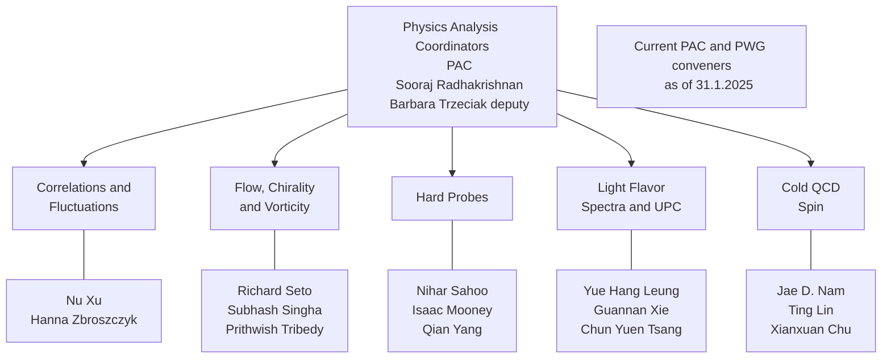

# How to get your results approved and published in STAR

*Barbara Trzeciak*  

## Table of Contents

- [Links](#links)
- [Analysis within PWG](#analysis-within-pwg)
- [Abstract](#abstract)
- [Preliminary results](#preliminary-results)
- [Presentation](#presentation)
- [Publication](#publication)
- [Policies](#policies)

## Links

- STAR Physics Pages of Common Interest (mostly up-to-date information): <https://drupal.star.bnl.gov/STAR/pwg/common>
- Check existing Analysis Notes and paper codes
- Talk to your supervisor and colleagues from the group
- Policies for the Publication and Presentation of STAR Results: <https://drupal.star.bnl.gov/STAR/system/files/PublicationPolicy101613_v2.html>

### Analysis Resources

- STAR analysis notes: <https://drupal.star.bnl.gov/STAR/starnotes>
- STAR theses: <https://drupal.star.bnl.gov/STAR/theses>
- STAR conference presentations: <https://drupal.star.bnl.gov/STAR/presentations/>
- STAR papers: <https://drupal.star.bnl.gov/STAR/publications/>
- GPC list: <https://www.star.bnl.gov/protected/common/GPCs/gpc-committees.xml>
- Run Log <https://online.star.bnl.gov/RunLog/>
- List of STAR embedding requests: <https://drupal.star.bnl.gov/STAR/starsimrequest>
- Production web-page: <https://drupal.star.bnl.gov/STAR/comp/prod>
- PicoDsts on distributed disk: <https://www.star.bnl.gov/public/comp/prod/localdata/DDpicosize.html>
- Production options: <https://www.star.bnl.gov/devcgi/dbProdOptionRetrv.pl>

### Preliminary and Presentation Resources

- Guidance and template (example) for preliminary figures: <https://drupal.star.bnl.gov/STAR/pwg/common/Preliminary-figures>
- Preliminary request template: <https://drupal.star.bnl.gov/STAR/system/files/Prelim_Request_template.pdf>
- Archive of STAR preliminary plots: <https://drupal.star.bnl.gov/STAR/pwg/common/star-preliminary-results-archive>
- Guidance for STAR talks and posters: <https://drupal.star.bnl.gov/STAR/pwg/common/policies/guidances-star-presentations>

### Publication Resources

- PWGC preview requirements: <https://drupal.star.bnl.gov/STAR/pwg/common/policies/pwgc-preview-requirements>
- Paper publication procedure: <https://drupal.star.bnl.gov/STAR/pwg/common/STAR-Paper-Publication-Procedure>
- Analysis computing code guidelines: <https://drupal.star.bnl.gov/STAR/pwg/common/policies/Guidelines-paper-code-preparations>
- Analysis Note requirements: <https://www.star.bnl.gov/protected/common/GPCs/TechnicalNote.html>
- God-Parent Committee (GPC) duty: <https://drupal.star.bnl.gov/STAR/pwg/common/policies/Responsibilities-GPC-members>
- Instructions on HepData submission: <https://drupal.star.bnl.gov/STAR/blog/marr/instructions-hepdata-submission>
- Significant digits for HepData table: <https://drupal.star.bnl.gov/STAR/pwg/common/policies/significant-digits-hepdata-table>

## Analysis within PWG

### Physics Working Groups

<https://drupal.star.bnl.gov/STAR/pwg/common/pwg-conveners>

- Sign up to your PWG mailing, STAR talks and other lists of interests! <https://www.star.bnl.gov/central/lists/>
- Participate in PWG weekly meetings!

### Your analysis -- prepare

1. Choose your (favorite) topic.
2. Familiarize yourself with ROOT, STAR infrastructure, etc.
3. Familiarize yourself with the topic.
   - STAR papers: <https://drupal.star.bnl.gov/STAR/publications/> and <https://www.star.bnl.gov/protected/common/GPCs/gpc-committees.xml>
   - STAR analysis notes: <https://drupal.star.bnl.gov/STAR/starnotes>
   - STAR theses: <https://drupal.star.bnl.gov/STAR/theses>
   - STAR conference presentations: <https://drupal.star.bnl.gov/STAR/presentations/>
4. Start your analysis!

### Your analysis -- start

1. Start your analysis!
2. Discuss the analysis with your supervisor/advisor.
3. Ask for advice from more experienced colleagues.
4. Check existing STAR paper codes -- available on CVS (with the same number as the corresponding note).
5. Present frequently at PWG meetings!
6. Present at STAR Collaboration Meetings
7. Request official STAR simulations (embedding), if needed. (all requests are directed to PWG conveners)
   <https://drupal.star.bnl.gov/STAR/starsimrequest>

## Abstract

### Requirements for Abstract Submission

You can submit abstract when:

- Analysis is completed and data are published or data already have Preliminary label.
- Analysis has started and is at an advanced level:
  - You have presented your analysis to PWG multiple times (at least twice)! Including QA, signal, efficiency, etc.
  - Data you intend to use is ready.
  - Bad run list and centrality calibration, if applicable, are finalized.
  - If your analysis requires official simulations, the production needs to be completed or at least vetted.

  

### Abstract Submission Process

1. Discuss abstract with your supervisor/advisor.
2. Submit abstract to STAR **at least 2 weeks** before the conference deadline!
   <https://drupal.star.bnl.gov/STAR/presentations> "Submit Material" tab.
   *It stays for one week in PWG and then one week for PAC comments.*
3. Submit abstract to the conference after official STAR approval!
   *For big conferences, like Quark Matter, Hard Probes, PAC submits all STAR abstracts.*

Remember to include your name and "(for the STAR Collaboration)" in your abstract.

## Preliminary results

### Requirements for Preliminary Results

- Obtain physics results. Present regularly in PWG.
  *The STAR Preliminary label is not needed for plots from which no one can deduce physics messages.*
- *Systematic uncertainties* should either be finalized, or it should be argued that they are subleading to statistical uncertainties (consult with PWG).
- When releasing new figures with theory curves, please confirm with theorists beforehand that their calculations are plotted and labeled properly.
- **Preliminary results can only be updated through publication.**
- Get the Preliminary label!

### Preliminary Request

- Preliminary status can be requested any time.
- **Send request ahead (~two weeks before submission of conference presentation).**
- Prepare preliminary request:
  - Create drupal page with your preliminary plots (in png, pdf, and eps formats) and summary of what is included in your preliminary analysis - slides or short note.
  - Slides (note) should include: data run list, cuts, systematic uncertainties (and how they were calculated), MC embedding production.
  - List which systematic uncertainties were not used in the preliminary results, but will be needed in the final results.
- Send request and link to plots to PWG, conveners need to approve your results.
- Request template: <https://drupal.star.bnl.gov/STAR/system/files/Prelim_Request_template.pdf>

### Preliminary Plots

- **All the preliminary figures MUST contain a "STAR Preliminary" label.**
- Preliminary status is granted to data points, not figures. Figures can be re-made, if needed, as long as the data points are kept the same.
- Guidance:
  - On the preliminary figures, x-axis and y-axis titles and labels should be shown clearly.
  - Information about the dataset used for the preliminary figure, such as year, collision system, collision energy, centrality if applicable, needs to be displayed.
  - Other key information, such as the kinematic cuts, legend, etc, should be added as well.
  - Font size should be reasonably large such that audience can clearly see them.

  

- Guidance and template (example): <https://drupal.star.bnl.gov/STAR/pwg/common/Preliminary-figures>
- Archive of STAR preliminary plots: <https://drupal.star.bnl.gov/STAR/pwg/common/star-preliminary-results-archive>

## Presentation

### Conference Presentation

1. Discuss your presentation with local group.
2. Use high resolution plots.
3. **Submit presentation at least 2 weeks before the conference starts!**
   <https://drupal.star.bnl.gov/STAR/presentations>
   *It stays for one week in PWG and then one week for PAC comments.*
4. Rehearse your talk in front of local STAR group.
   *For major conferences, such as Quark Matter, there is rehearsal before the collaboration.*
5. Address all comments.
6. Guidance for STAR presentations: <https://drupal.star.bnl.gov/STAR/pwg/common/policies/guidances-star-presentations>
7. **Prepare conference proceedings!**
8. Again, submit it to drupal and go via the approval procedure.

## Publication

### Publication Process (in short)

1. Finalize all the open and preliminary aspects of your analysis. Discuss regularly in PWG.
2. Once your results are ready for publication, request **PWGC preview**.
   <https://drupal.star.bnl.gov/STAR/pwg/common/policies/pwgc-preview-requirements>
3. After the PWGC preview continue PWG review: address PWGC comments, **prepare Analysis Note and paper draft.** Send them to PWG for comments and conveners approval.
4. Prepare analysis computing code for CVS submission. Guidelines: <https://drupal.star.bnl.gov/STAR/pwg/common/policies/Guidelines-paper-code-preparations>
5. Request God-Parent Committee (GPC) formation.
   <https://drupal.star.bnl.gov/STAR/pwg/common/policies/Responsibilities-GPC-members>

### PWGC Preview Requirements

Required documents:

- Webpage containing:
  - PA list
  - Target journal
  - Paper title
  - Abstract
  - Figures with major if not all systematic uncertainties and captions
  - Tables, if any, with captions
  - Conclusions including physics messages
  - Links to relevant PWG presentations for reference
- A presentation to the PWGC panel: recommended template
- Analysis note: optional
- Paper draft: optional

## Policies

### STAR Publication and Presentation Policies

- Policies for the Publication and Presentation of STAR Results:
  <https://drupal.star.bnl.gov/STAR/system/files/PublicationPolicy101613_v2.html>

- Official STAR rules - written in formal way, when preparing presentation or publication it's often easier to consult guidelines.
- But cross check with the official policies in case of doubts.

- STAR Physics Pages of Common Interest: <https://drupal.star.bnl.gov/STAR/pwg/common>

### Responsibilities for GPC members

For the definition and scope of the God-Parent Committee, see STAR publication policy, section 14 for details.

*The GPC will review the paper to ensure that the presentation of the physics (or technical) message and the data is clear and persuasive. It should take into account the overall construction of the paper and the logical flow of the text as well as the technical accuracy and the correctness of the analysis.*

**Chair**

- Oversee the whole GPC procedure, and make sure it goes smoothly and in a timely fashion
- Call for meetings
- Set up deadlines for the GPC to provide comments to PAs
- Communicate with Physics Analysis Coordinator

**Member at large**

- Participate in meetings
- Provide feedback in time

**English QA**

- Check typo, grammar and logical flow of the content of the manuscript

**Code QA**

- Make sure instructions are easy to follow and complete
- Make sure the codes compile and run properly
- Reproduce exactly the analysis results based on the few files provided by PAs
- Be able to reproduce the paper figures
- A tip: one can run `cppcheck` on RCF to find potential mistakes. The syntax is `cppcheck --enable=all test.C` or `cppcheck --enable=all StRoot/StMyAnalysis`, where the former checks only the supplied macro while the latter checks all the codes in the directory

# **Guidelines for preparing paper codes to be committed to CVS**

- General guideline: people should be able to reproduce paper figures using provided instructions, codes and histograms

## What should be included

- Analysis source code, such as analysis makers, job submission script, plotting macros, etc
- Modified files of standard makers from STAR library
- Small rootfiles containing necessary histograms, including those from running the full statistics, for reproducing paper figures
- Instructions on how to run the code such that Code QA can reproduce the paper figures
- Final results based on a small amount (1-2) of input PicoDst/MuDst and/or embedding files. These results will naturally have large error bars, but code QA should be able to reproduce them exactly.
- Input PicoDst/MuDst and/or embedding files used to generate the results above should be restored and saved on RCF, but not needed to be committed to CVS

## What should not be included

- Secondary files, such as library files (.o, .so), figures, etc, that can be produced from source code
- Log files
- Empty directories
- Remove all the directories named "CVS" (check the subdirectories as well). Otherwise, one might get into trouble during committing.
- Standard makers that can be obtained from the STAR official library. Instructions should be given on how to retrieve the correct version of these makers. If some files are modified within a standard marker, only the modified files should be committed
- For common codes, such as StRefMultCorr, that are used multiple times in different parts of the analysis, they should be committed only once.
- Rootfiles of raw data, embedding data, analysis trees, etc.
- Private embedding data, analysis trees, analysis histograms etc are recommended to be backed up to HPSS ([How-to](https://drupal.star.bnl.gov/STAR/comp/sofi#HPSS))
