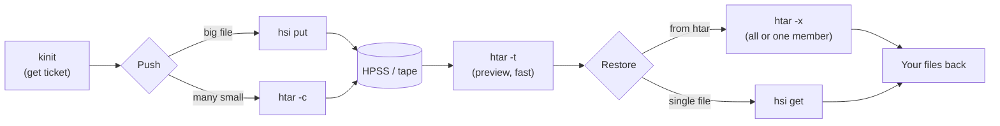

# What is HPSS?

HPSS (High Performance Storage System) is the **tape** storage system BNL uses for
long-term storage. STAR uses it to archive data and simulation. HPSS is **not** a
regular file system — you cannot `cd` into it or open files directly. Instead you use
two commands, `hsi` and `htar`, to push files to tape (archive) and pull them back
(restore).

Because the data lives on physical tape, retrieving a file is **not instant** — the
robot may need to mount a tape and seek to your data, which can take from seconds to
several minutes. This is normal.

[Check your HPSS request status](https://www.star.bnl.gov/devcgi/display_accnt.cgi)


# The big picture




# Step 0 — Log in (`kinit`)

HPSS uses Kerberos. **Before** any `hsi`/`htar` command you need a valid ticket

```bash
kinit                  # uses your default principal (prompts for your BNL password)
klist                  # check the ticket — look for a future "Expires" date
```

- You only need to `kinit` **once per session**; every command below reuses the ticket.
- A ticket lasts a few days. If `klist` shows none/expired, run `kinit` again.

# Which tool do I use?

| Tool   | Use it for                                      | Think of it as |
|--------|-------------------------------------------------|----------------|
| `hsi`  | Browsing HPSS; pushing/pulling **one big file** | `cd`/`ls` + `cp` to tape |
| `htar` | Bundling **many small files** into one archive  | `tar` straight to tape |

Rule of thumb: **one large file → `hsi`. Many small files → `htar`.**


# Best practices (please read — from Jerome Lauret)

HPSS is a tape system and does **not** like many small files:

1. **Be intentional.** Think before you push — a pile of log files you'll never read
   again just wastes tape. Don't push everything "just in case"; save only what you
   actually need.
2. **Big files (multi-GB root, etc.) → `hsi`.**
3. **Many small files → `htar`**, which aggregates them (like `tar`) into one archive.
   Alternatively, make a local `tar` archive with a timestamp in its name and push that
   single file with `hsi`.

Never push thousands of loose small files individually — aggregate first.


# `hsi` — browse HPSS and move big files

`hsi` ([docs](https://www.racf.bnl.gov/Facility/HPSS/Documentation/HSI/)) is an
interactive shell into your HPSS space; most Linux commands work (`pwd`, `ls`, `cd`,
`mkdir`, `rm`, `rmdir`). Run it interactively by typing `hsi`, or — recommended — pass a
single quoted command:

```bash
hsi "pwd"                             # your HPSS home
hsi "ls -l /home/<user>/backup"       # list a directory
hsi "mkdir -p /home/<user>/backup"    # make a directory on HPSS
```

**Push** a big file (`put LOCAL : HPSS`) and **restore** it (`get LOCAL : HPSS`):

```bash
hsi "put results.root : /home/<user>/backup/results.root"   # archive
hsi "get results.root : /home/<user>/backup/results.root"   # restore
```

Small-files alternative (Jerome's tip) — bundle locally with a timestamp, push one file:

```bash
tar -czf logs_2026-06-10.tar.gz mylogs/*.log
hsi "put logs_2026-06-10.tar.gz : /home/<user>/backup/logs_2026-06-10.tar.gz"
```


# `htar` — bundle many small files

`htar` ([docs](https://www.sdcc.bnl.gov/sites/default/files/2021-09/htar.txt),
[STAR notes](https://drupal.star.bnl.gov/STAR/comp/sofi/hpss/htar)) is like `tar` but
writes straight to HPSS. It also makes a separate **index** (`*.tar.idx`) so you can
list the contents without staging the data, so each archive shows up as **two** files
(`name.tar` and `name.tar.idx`). Always give an action flag: `-c` create, `-x` extract,
`-t` list.

```bash
htar -c  -f /home/<user>/backup/data.tar /path/to/files/*.root   # create
htar -cP -f /home/<user>/backup/data.tar /path/to/files/*.root   # create + make HPSS path
```

- Add **`-P`** if the HPSS destination directory doesn't exist yet (otherwise:
  `ERROR: Nonexistent path (do you need -P?)`).
- **Overwrite is automatic** (no prompt).
- **Directory structure is preserved relative to where you run it.** Running it on
  `/path/to/files/*.root` restores to `<cwd>/path/to/files/...`; `cd`-ing in first and
  running on `*.root` restores to `<cwd>/...`.


# Preview an archive (before restoring)

`htar -t` lists the contents — it reads the index, so it's fast and does **not** pull
data off tape:

```bash
htar -tf /home/<user>/backup/data.tar
```

(A line like `HTAR_CF_CHK_...` is htar's internal checksum member — ignore it.) For a
plain `hsi` file, just `hsi "ls -l ..."`.


# Restore files

```bash
cd /path/to/restore_dir

htar -xf /home/<user>/backup/data.tar               # restore EVERYTHING
htar -xf /home/<user>/backup/data.tar data/a.txt    # restore ONE member (path from -t)
hsi "get results.root : /home/<user>/backup/results.root"   # restore a big single file
```

Restoring one member from a big archive avoids downloading the whole thing.


# Cleaning up

```bash
hsi "rm /home/<user>/backup/data.tar /home/<user>/backup/data.tar.idx"  # archive + its index
hsi "rmdir /home/<user>/backup"                                          # empty directory
```

htar archives come as a **pair** — delete both the `.tar` and the `.tar.idx`.


# Tips

- **No ticket = nothing works** — `klist` to check, `kinit` to renew.
- **Tape is slow.** A cold archive can take minutes to stage. Pulling many members in one
  command is cheaper than calling `htar` repeatedly.
- **Overwrites are silent** (htar create and extract) — check your destinations.


# Quick reference

```bash
# browse
hsi "pwd"                               # HPSS home
hsi "ls -l /home/you/backup"            # list

# big single file
hsi "put file.root : /home/you/backup/file.root"   # archive
hsi "get file.root : /home/you/backup/file.root"   # restore

# many small files
htar -cP -f /home/you/backup/data.tar  data/*       # archive (-P makes the path)
htar -tf  /home/you/backup/data.tar                 # preview contents (fast)
htar -xf  /home/you/backup/data.tar                 # restore all
htar -xf  /home/you/backup/data.tar  data/a.txt     # restore one member

# cleanup
hsi "rm /home/you/backup/data.tar /home/you/backup/data.tar.idx"
```
