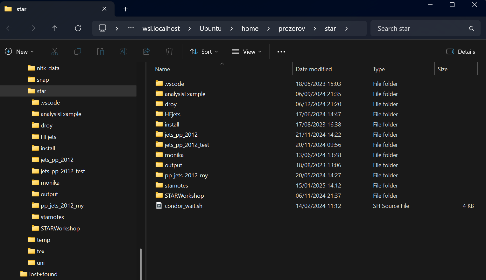

Replace your account name in example below:

```bash
sudo apt install sshfs
mkdir ~/star
alias starmount='sshfs -o reconnect,ServerAliveInterval=15,ServerAliveCountMax=3  prozorov@sftp.sdcc.bnl.gov:/gpfs01/star/pwg/prozorov ~/star' # add this line to your .bashrc or .bash_aliases
starmount
```


