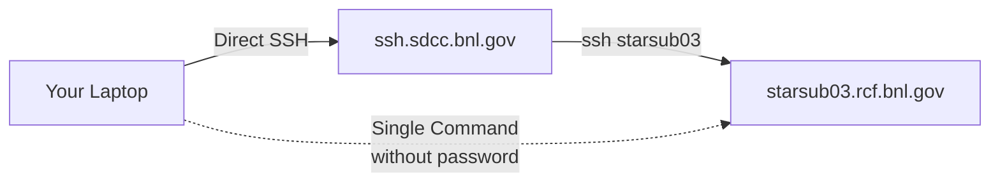

# SDCC access without password

As stated here: "Think of the hours I have saved!" - by not typing passwords thousands of times.



## Introduction

SSH is essential for secure remote system access to BNL (Brookhaven National Laboratory) networks, but typing passwords repeatedly is inefficient and less secure. This tutorial shows how to set up passwordless SSH using SSH keys and the SSH agent.

## Quick Setup Guide

### 1. (Optional) Generate SSH Keys

```bash
ssh-keygen -b 4096 -t rsa
```

### 2. (Optional) Upload Your Public Key to SDCC 

1. Get your key's fingerprint:
   ```bash
   ssh-keygen -l -E md5 -f ~/.ssh/id_rsa.pub
   ```
2. Upload your public key at: <https://web.SDCC.bnl.gov/Facility/SshKeys/UploadSshKey.php>

### 3. Copy Public Key to SDCC Machines

Go to the SDCC machine using your password and create the `.ssh` directory:
```bash
mkdir -p ~/.ssh
chmod 700 ~/.ssh
touch ~/.ssh/authorized_keys
chmod 600 ~/.ssh/authorized_keys
```
Your home directory is shared between all `starsub` machines (but NOT the gateways `ssh`)
One can directly paste the content of your home machine `~/.ssh/id_rsa.pub` into `~/.ssh/authorized_keys` on the SDCC machine. Simple copy-paste with `nano`/`vim`.

## Configure SSH Client on your local machine

### 4. Set Up SSH Agent

Check if running:
```bash
ssh-add -L
```

Add your key:
```bash
ssh-add
```
### 5. Modify local .ssh/config

You will [have] come across tutorials that instruct you to type `ssh -XYA ...`and maybe some more options. Don’t. Your time is too valuable for that. Make all those options the default in your `~/.ssh/config` file.

```bash
touch ~/.ssh/config
chmod 600 ~/.ssh/config
```
An example of my `~/.ssh/config`:

```bash

# === Global Settings ===

# Enable SSH agent forwarding (useful if you use ssh keys on remote servers)
ForwardAgent yes

# Enable X11 forwarding (GUI apps over SSH)
ForwardX11 yes
ForwardX11Trusted yes

# Allow connections to localhost without strict host key checking
NoHostAuthenticationForLocalhost yes

# Specify default identity file (private key)
IdentityFile ~/.ssh/id_rsa

# === STAR Server Shortcut ===

Host star
    User prozorov
    HostName starsub07.sdcc.bnl.gov
    ProxyJump prozorov@ssh.sdcc.bnl.gov
    RequestTTY yes
    ForwardAgent yes

# === Legacy RCAS Machines (rcas6005 to rcas6016) ===

Host rcas60*
    User prozorov
    HostName %h.rcf.bnl.gov
    ProxyJump prozorov@ssh.sdcc.bnl.gov
    RequestTTY yes
    ForwardAgent yes

# === Alma9-Based STAR Subnodes (starsub01 to starsub07) ===

Host starsub0*
    User prozorov
    HostName %h.sdcc.bnl.gov
    ProxyJump prozorov@ssh.sdcc.bnl.gov
    RequestTTY yes
    ForwardAgent yes
```

Now, you can access `starsub0x` and `star` directly from your laptop with a single command:

```bash
ssh star
ssh starsub05
ssh rcas6013
```


## Understanding SSH Keys

SSH keys use public-key cryptography with two components:
- **Public Key**: Shared with servers, used to encrypt data
- **Private Key**: Kept secret, used to decrypt data

## Why SSH Keys are Better than Passwords
- No reusable credentials transmitted over the network
- Can be used with SSH agent to avoid repeated typing
- Different keys can be used for different services
- Much more resistant to brute-force attacks

### Sidenote:
Sometimes when using STAR scheduler without password it can throw a mistake about logging
`We could not write to your log file. Please check that you have access to: /afs/rhic.bnl.gov/star/doc/www/html/tmp/pub/scheduler/prozorov.log .You may need to kinit and aklog to write to this area.
java.lang.IllegalStateException: ManagerFactory [org.apache.logging.log4j.core.appender.FileManager$FileManagerFactory@3b2c72c2] unable to create manager for [/afs/rhic.bnl.gov/star/doc/www/html/tmp/pub/scheduler/prozorov.log] with data [org.apache.logging.log4j.core.appender.FileManager$FactoryData@491666ad]`


To solve it, one should type a password using `kinit` and `aklog`.
``` bash
kinit
aklog
```
