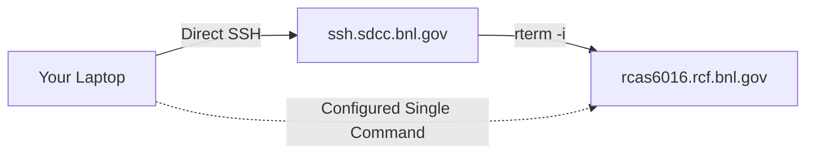

# SDCC access without password

As stated here: "Think of the hours I have saved!" - by not typing passwords thousands of times.



## Introduction

SSH is essential for secure remote system access to BNL (Brookhaven National Laboratory) networks, but typing passwords repeatedly is inefficient and less secure. This tutorial shows how to set up passwordless SSH using SSH keys and the SSH agent.

## Understanding SSH Keys

SSH keys use public-key cryptography with two components:

- **Public Key**: Shared with servers, used to encrypt data
- **Private Key**: Kept secret, used to decrypt data

## Why SSH Keys are Better than Passwords

- No reusable credentials transmitted over the network
- Can be used with SSH agent to avoid repeated typing
- Different keys can be used for different services
- Much more resistant to brute-force attacks

## Quick Setup Guide

### 1. Generate SSH Keys

```bash
ssh-keygen -b 4096 -t rsa
```

Enter a strong passphrase when prompted.

### 2. Upload Your Public Key to SDCC

1. Get your key's fingerprint:

   ```bash
   ssh-keygen -l -E md5 -f ~/.ssh/id_rsa.pub
   ```

2. Upload your public key at: <https://web.SDCC.bnl.gov/Facility/SshKeys/UploadSshKey.php>

### 3. Copy Public Key to SDCC Machines

1. Go to the SDCC machine using your password and create the `.ssh` directory:

```bash
mkdir -p ~/.ssh
chmod 700 ~/.ssh
```

Your home directory is shared between all `rcas` machines (but NOT the gateways `ssh`)

```bash
scp ~/.ssh/id_rsa.pub username@rftpexp.rhic.bnl.gov:.ssh/authorized_keys
```

Or, if `scp` is not available, one can directly paste the content of your home machine `~/.ssh/id_rsa.pub` into `~/.ssh/authorized_keys` on the SDCC machine.

Then on a SDCC machine:

```bash
chmod 600 ~/.ssh/authorized_keys
```

### 4. Set Up SSH Agent

Check if running:

```bash
ssh-add -L
```

Add your key:

```bash
ssh-add
```

## Configure SSH Client on you local machine

You will [have] come across tutorials that instruct you to type `ssh -XYA ...`and maybe some more options. Don’t. Your time is too valuable for that. Make all those options the default in your `~/.ssh/config` file.

An example of my `~/.ssh/config`:

```bash
# Global settings
ForwardAgent yes # enable agent forwarding - optin -A in ssh command
ForwardX11 yes # option -X in ssh command
ForwardX11Trusted yes # option -Y in ssh command
NoHostAuthenticationForLocalhost yes 

Host star  #  any star server rcas60xx
    User prozorov
    HostName ssh.sdcc.bnl.gov
    RemoteCommand rterm -i
    RequestTTY yes
    IdentityFile ~/.ssh/id_rsa # your private key (without .pub) 

Host rcas60*  # specific rcas machine  from rcas6005 to rcas6016
    User prozorov
    HostName %h.rcf.bnl.gov # %h is replaced with the host name i.e. rcas*
    ProxyJump prozorov@ssh.sdcc.bnl.gov # use a middle jump host
    RequestTTY yes
    IdentityFile ~/.ssh/id_rsa # your private key (without .pub)
```

Now, you can access `rcas6016` and `star` directly from your laptop with a single command:

```bash
ssh rcas6016 # or star
```

## Conclusion

Using SSH keys with proper BNL configuration:

- Eliminates password typing
- Improves security
- Simplifies access to complex BNL networks
- Saves time on repeated logins
