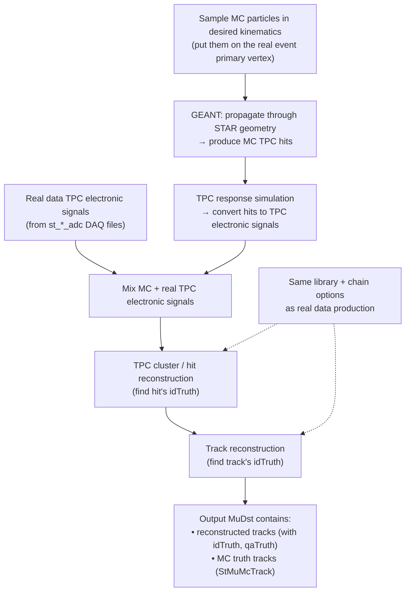

# STAR Embedding 
 _Monika Robotkova_

## Table of contents
{: .no_toc .text-delta }

1. TOC
{:toc}

## What “embedding” means in STAR

In STAR analyses, we often need **detector acceptance × reconstruction efficiency** to correct raw spectra. The key problem is that tracking efficiency (especially in the TPC) depends ontions: luminosity/occupancy, dead channels, run-by-run vertex distribution, pileup, etc. 

**Embedding** solves this by:

* Simulating *only the signal tracks you care about* (e.g., electrons, pions, J/ψ daughters),
* **Mixing** their simulated TPC response into **real** data events,
* Re-running the **same reconstruction chain** as for real data,
* Then measuring how many simulated tracks survive as reconsos**
* Much cheaper than full event simulation + full detector response for every event. **
* Must be produced per particle/analysis and per dataset/trigger setup to be correct. 

---

## The embeddibig picture

**Key is **st_*_adc DAQ** as the “real detector signals” input (not arbitrary DAQ flavors). 

---

## What you analyze in the output (truth matching)

Embedding is typically delivered as **MuDst.root** files that include:

* `StMuMcTrack` (all MC truth tracks),
* `StMuMcVertex` (MC verticTruth()` = best-matched MC track id,
* `StMuTrack::qaTruth()` = match quality (percent). 

That means you can compute efficiencies directly from MuDst without extra bookkeeping.

Star embedding example macro:

* `cvs co StRoot/macros/embedding/anamudst`

---

## Production lifecycle
 
* Select DAQ sample based on the embedding request,
* Stage DAQ + corresponding MuDst from HPSS to NFS disks (e.g. `/star/embed/...`),
* Configure embedding code with requested parameters,
* Produce a **test production**,
* A helper performs **Base QA**,
* Run full production ics analyst (PA) performs QA + informs PWG,
* If OK, request is closed,
* Data stay on NFS “> 6 months” (may be deleted later unless restored). 

---

## How to find existing embeddings (before request):

* Current embedding NFS areas (examples): `/star/data105`, `/star/embed`, `/star/data18`, and looking for productions like: 

  * `/star/embed/embedding/<TriggerSetName>/<EmbeddedParticle>_<fSet>:contentReference[oaicite:27]{index=27} verify all requested **fSet** chunks exist from `fSet min`to`fSet max`. If not complete, contact the embedding coordinator or mailing list. 

---

## What goes into an embedding request 

Before requesting, STAR expects you to present the analysis in your PWG and justify why embedding is needed.  includes: 

### Real data sample details (what you mix into)

* Trigger set name (from a STAR “data summary” page) 
* DAQ file type (embedding uses **st_*_adc** DAQ) 
* Approx. number of events to sample (often start small; scale up)
* Production tag (e.g., `P15ic`)
* Run range + good/bad runs list
* Trigger IDs
* Vertex cuts / selection method (Vz, VPD constraints, etc.)
* Optional extra event cuts (e.g. refmult/grefmult)

### Simulation + reconstruction details (what you inject)

* Particle type and decay channel (if unstable)
* pT range + distribution shape (flat / exponential / etc.)
* Rapidity or pseudorapidity range (**be explicit which**)
* Number of MC particles per event (often “~5% of refmult/grefmult”, or a fixed number)
* If using a generator embedding (e.g. HIJING / PYTHIA): generaameters
* Special chain requirements (e.g. turn off some detectors, special tracking)
* Whether you need EMC or BTOF simulator

---

## Embedding vs STARSIM (when you use which)

The slides contrast embedding with “STARSIM” style simulation: 

* **STARSIM**: generate events + run detector simulation; faster for detector-response studies, but does **not** automatically capture real run conditions.
* **Embedding**: inject signal into real events → captures the messy realchannels, vertex profile, pileup) and is the go-to for final efficiency corrections.

Background context:

* GEANT3 / GEANT4 are the underlying particle-transport tools; GEANT4 is commonly used where more detailed calorimeter modeling is needed.

---

## Extras

### Requests, status, and coordination

* Embedding request / existing samples list (STAR internal): \url{https://drupal.star.bnl.gov/STAR/starsimrequest}
* Embedding mailing list info (public list server page): \url{https://lists.bnl.gov/sympa/info/starembd-l}

### Simulation & reconstruction docs

* STAR simulation framework overview (STAR internal): \url{https://drupal.star.bnl.gov/STAR/comp/simu/star-simulation-framework} 
* “Running starsim within root4star” how-to (STAR internal): \url{https://drupal.star.bnl.gov/STAR/comp/simu/simulation-howtos/running-starsim-within-root4star}
* STAR reconstruction software page (STAR internal): \url{https://drupal.star.bnl.gov/STAR/comp/reco/star-reconstruction-software}
### Geometry tags & tools

* Production/geometry tags lookup (often STAR-protected): \url{https://www.star.bnl.gov/devcgi/dbProdOptionRetrv.pl}
* A handy public tool repo that points to STAR geometry-tag resources: \url{https://github.com/star-bnl/star-travex}

  * (That repo references the STAR “MCGeometry” page: \url{https://drupal.star.bnl.gov/STAR/comp/prod/MCGeometry})

### Generator macros directory

* STAR StarGenerator macros directory listing (doxygen-style): \url{https://www.star.bnl.gov/webdata/dox/html/dir_6e5f5a5c4b804c2e372f5894a2b5b4d7.html}
