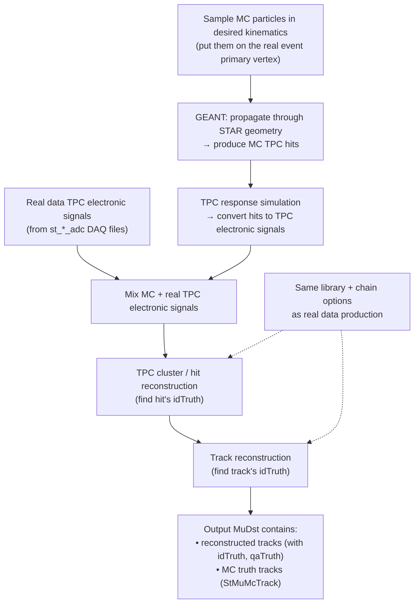

# STARsim and embedding in STAR
{: .no_toc }

*Alexandr Prozorov, Monika Robotkova*
{: .fs-4 .fw-300 }

## Table of contents
{: .no_toc .text-delta }

1. TOC
{:toc}


## What is STARsim?
* **STARsim** is STAR’s simulation environment: generate particles, propagate them through STAR geometry with **GEANT3**, and write out MC “detector hits” (typically `*.fzd`), then run **BFC** to digitize + reconstruct into analysis-ready `*.MuDst.root`. 
* **Embedding** is “simulation inside real data”: you mix simulated detector signals into **real DAQ backgrounds** and reconstruct with the **same production chain** as data → realistic occupancy, noise, run-by-run conditions “for free”.  
* To get embedding produced, you prepare the request details in your PWG, then a PWG convener submits the request on the STAR embedding request page.
  
**STARsim** is the STAR simulation framework built around **GEANT3**, integrated into the standard STAR software (“big full chain”). In practice, you run a ROOT macro (via `root4star`) that:

1. generates your MC particles/events (single-particle “kinematics”, **Pythia**, **HIJING**, etc.),
2. runs GEANT to propagate them through STAR geometry and score hits,
3. writes out a **ZEBRA** `*.fzd` file (MC hits + geometry + event record) plus a ROOT file with the generator record.  

A very common workflow is:

* `starsim` (produce `*.fzd`) → `bfc` (digitize + reconstruct) → `*.MuDst.root` for analysis. 

**Useful starting points**

* STAR simulation framework: [https://www.star.bnl.gov/public/comp/simu/newsite/](https://www.star.bnl.gov/public/comp/simu/newsite/)
* Example macros in STAR: `$STAR/StRoot/StarGenerator/macros` 
* Community example macros (y2019): [https://github.com/klendathu2k/star-simulation-examples/tree/main/macros/y2019](https://github.com/klendathu2k/star-simulation-examples/tree/main/macros/y2019) 

---

## “Straight simulation” in 3 steps (STARsim → BFC → analysis)

### 1) Run STARsim (produce `*.fzd`)

You typically copy an example macro and run it with `root4star`. For example (HIJING / kinematics / pythia8 style workflows): 

```bash
ls $STAR/StRoot/StarGenerator/macros
cp $STAR/StRoot/StarGenerator/macros/starsim.hijing.C .
ln -s starsim.hijing.C starsim.C
root4star -q -b starsim.C\(10,1111,\"y2016a\"\)
ls *.fzd
```

### 2) Run digitization + reconstruction (BFC)

In STAR, the **digitization** (“slow simulation” / detector response) is usually run **inside the reconstruction chain** so that the output matches real production conditions as closely as possible. 

### 3) Analyze `MuDst`

After successful reconstruction, you analyze `*.MuDst.root`. These files contain reconstructed objects, and (for MC/embedding) also provide access to truth information via `idTruth` / `qaTruth` and MC truth tables. 

---

## What is embedding (and why do we use it)?

In many STAR measurements you need **acceptance × reconstruction efficiency** under *real* running conditions. Pure simulation can miss (or require heavy tuning for) things like:

* realistic TPC occupancy and pileup,
* detector noise and dead channels,
* run-by-run vertex distributions and luminosity conditions.  

**Embedding** solves this by **merging simulated detector signals with real measured backgrounds** channel-by-channel and then reconstructing with the **same chain options and libraries** as the real data production.  

Two common embedding “modes”: 

* **Single-particle embedding** into minimum-bias data → great for tracking efficiency.
* **Full-event embedding** into zero-bias data → useful for vertex-finding / precision-tracking studies.

---

## How embedding works (cartoon workflow)



Key idea: your simulated tracks “live” inside a **real** event, so the reconstruction is stress-tested by the same backgrounds your analysis sees in data. 

---

## How to create an embedding request (what you must prepare)

### Who submits it?

Embedding requests are typically:

1. discussed and approved in the **PWG**,
2. submitted by the **PWG convener** via the STAR embedding request page.  

Request page (form): [https://drupal.star.bnl.gov/STAR/comp/embedding/submit](https://drupal.star.bnl.gov/STAR/comp/embedding/submit) 

### What information is required?

You need two blocks of information: **(A) real data sample** and **(B) simulation + reconstruction settings**.  

#### A) Real data sample (what you embed into)

Include:

* **Trigger set name** (dataset/production label used by STAR) 
* **File type** (important: embedding uses **only `st_*_adc` DAQ files**) 
* **Production tag** (e.g. `P15ic`) 
* **Run range** (+ bad runs list, or explicit good runs list) 
* **Trigger IDs** (e.g. HT1 IDs) 
* **Vertex cuts & vertex selection method** (Vz/Vr, VPD constraint, etc.) 
* Any extra **event cuts** (e.g. `refmult > ...`) 

> Practical note: due to disk constraints, embedding often starts from a sampled set of DAQ files (e.g. ~100k events), which can then be embedded multiple times to reach the desired total statistics. 

#### B) Simulation and reconstruction (what you embed)

Include:

* **Particle type** and **decay mode** (if unstable) 
* **pT range** and distribution (flat / exponential / custom) 
* **η or y range** (be explicit: *pseudorapidity* vs *rapidity*) 
* **# of MC particles per event** (often a small fraction of multiplicity is recommended; sometimes fixed for p+p) 
* If using a full **event generator embedding** (Pythia/HIJING/StarLight in zero-bias), provide at least the **generator version** 
* Special reconstruction requirements (extra **BFC tags**, tracker settings, etc.) 
* Whether you need **EMC** and/or **BTOF** simulators 

### A copy/paste request template (fill in and send to your convener)

```text
[Embedding request summary]
Physics goal:
Why embedding is needed (what efficiency/purity you will extract):

(A) Real data sample
- Trigger set name:
- File type (must be st_*_adc):
- Production tag:
- Run range (and bad runs list / good runs list):
- Trigger IDs:
- Vertex selection + cuts (Vz, Vr, VPD constraint, etc.):
- Other event cuts (refmult/grefmult, etc.):

(B) Simulation + reconstruction
- Embedded particle(s) + decay mode:
- pT range + distribution:
- eta or y range (state explicitly which one):
- # MC particles per event:
- Generator (if applicable) + version:
- Special BFC tags / chain options:
- Need EMC sim? Need BTOF sim?

Expected statistics:
- Target number of embedded events / tracks:
Notes:
- Any known caveats or special checks for QA:
```

---

## What happens after submission (so you know what to expect)

A typical embedding production flow looks like:  

1. DAQ files are sampled according to your request.
2. DAQ + matching reconstruction files are **restaged from HPSS to NFS** (e.g. under `/star/embed/...`).
3. A **test production** is launched and shared on disk.
4. “**Base QA**” is produced to catch obvious problems early.
5. If OK, the **full production** is launched; PWG/PA perform physics QA.
6. Data are kept on disk for **months**; older samples may be cleaned, but can be **restaged** from HPSS by contacting the embedding team.  

---

## How to use embedding output in your analysis

### What files you get

Embedding output is typically analyzed using **`MuDst.root`**, which contains everything needed for efficiency studies.  

What’s inside (high-level): 

* `StMuMcTrack`: all MC truth tracks
* `StMuMcVertex`: all MC truth vertices
* `StMuTrack::idTruth()`: best-matched MC track ID for a reconstructed track
* `StMuTrack::qaTruth()`: match quality (roughly, percent of matched hits)

### Minimal “sanity checks” you should always do

Base QA commonly checks: input kinematics, vertex ranges, triggers, #MC per event, and basic track distributions (φ/η/dE/dx/nHitsFit/DCA) compared between MC-tagged tracks and data. 

### Analysis skeletons you can start from

* Simple embedding MuDst analysis skeleton:
  `cvs co StRoot/macros/embedding/anamudst` 
* More comprehensive example:
  `cvs co offline/users/fisyak/macros/MuMc.C` 

### Common caveats (read this before you get confused)

* **Don’t apply dE/dx (nSigma) PID cuts on reconstructed MC-tagged tracks** in embedding efficiency studies (this can bias what “survives” in a non-obvious way). 
* Multiplicity variables like `refmult` can be **contaminated by embedded MC tracks**. 
* In some Au+Au embeddings, the number of input MC particles per event may scale with multiplicity (e.g. `max(5, 5%*refmult)`), which can bias event weighting if you treat the sample as plain minimum-bias without care. 

---

## Finding existing embeddings (before requesting a new one)

Before you request new embedding, check if one already exists:

1. Find the **request ID** in the STAR simulation/embedding request pages (use the search box).  
2. Check standard NFS locations (examples):  

```bash
# common places to look
ls /star/embed/embedding
ls /star/data18/embedding
ls /star/data105/embedding
```

3. Typical directory pattern:  

```text
/star/embed/embedding/${TriggerSet}/${EmbeddedParticle}_${fSet}_${RequestID}/
/star/data18/embedding/${TriggerSet}/${EmbeddedParticle}_${fSet}_${RequestID}/
/star/data105/embedding/${TriggerSet}/${EmbeddedParticle}_${fSet}_${RequestID}/
```

If the sample is not on disk (or only partial `fSet`s are present), email the embedding team / coordinator and ask to **restage from HPSS**, providing request ID, particle name, and which file type you need (MuDst, miniMc, geant/event, etc.).  

---

## Contacts and where to ask questions

* Simulation & embedding mailing lists: `starsimu-l@lists.bnl.gov`, `starembd-l@lists.bnl.gov`  
* Mattermost channel: [https://chat.sdcc.bnl.gov/star/channels/embedding-and-simulations](https://chat.sdcc.bnl.gov/star/channels/embedding-and-simulations) 
* Embedding is coordinated within the embedding team; large productions are prioritized and managed centrally.  
