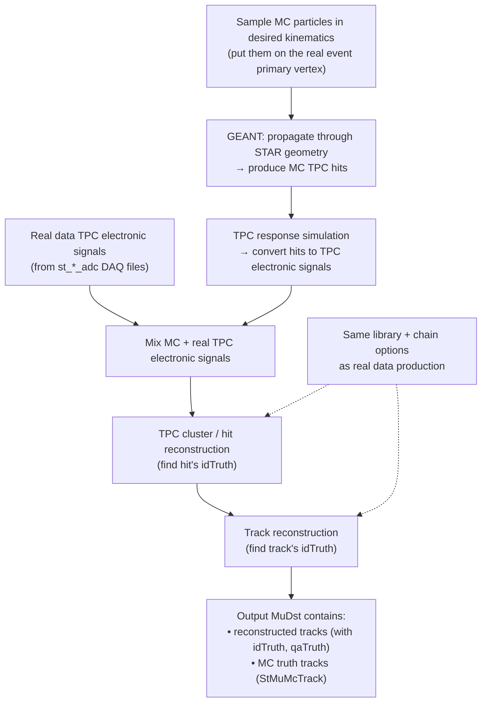
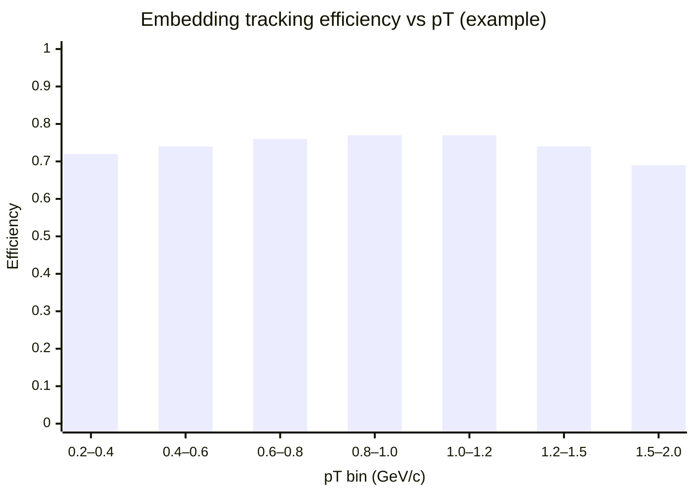

# STAR Embedding 
 _Monika Robotkova_

## Table of contents
{: .no_toc .text-delta }

1. TOC
{:toc}

## 1) What “embedding” means in STAR

In STAR analyses, we often need **detector acceptance × reconstruction efficiency** to correct raw spectra. The key problem is that tracking efficiency (especially in the TPC) depends ontions: luminosity/occupancy, dead channels, run-by-run vertex distribution, pileup, etc. 

**Embedding** solves this by:

* Simulating *only the signal tracks you care about* (e.g., electrons, pions, J/ψ daughters),
* **Mixing** their simulated TPC response into **real** data events,
* Re-running the **same reconstruction chain** as for real data,
* Then measuring how many simulated tracks survive as reconsos**
* Much cheaper than full event simulation + full detector response for every event. **
* Must be produced per particle/analysis and per dataset/trigger setup to be correct. 

---

## 2) The embeddibig picture)

This is the core idea shown in the “Embedding production structure” slide. 

**Key des **st_*_adc DAQ** as the “real detector signals” input (not arbitrary DAQ flavors). 

---

## 3) What you analyze in the output (truth matching)

Embedding is typically delivered as **MuDst.root** files that include:

* `StMuMcTrack` (all MC truth tracks),
* `StMuMcVertex` (MC verticTruth()` = best-matched MC track id,
* `StMuTrack::qaTruth()` = match quality (percent). 

That means you can compute efficiencies directly from MuDst without extra bookkeeping.

TSTAR example macro referenced in the slides:

* `cvs co StRoot/macros/embedding/anamudst` 

(If your workflow is picoDst-based,e converted—but MuDst is usually the recommended “source of truth” for efficiency work.) 

---

## 4) Efficiency definition + a Mermaid “histogram” example

A common definition (per pT bin) is:

* **Thrown**: number of MC tracks generated in that bin (from `StMuMcTrack`)
* **Found**: number of reconstructed tracks whose `idTruth` matches those MC tracks (often also requiring `qaTruth` above some threshold)

So:

[
\varepsilon(p_T) = \frac{N_{\text{reco & truth-matched}}(p_T)}{N_{\text{thrown}}(p_T)}
]

### Example bar-chart “histogram” in Mermaid

Below is an *illustrative* histogram-style bar chart (counts vs pT bins). Replace the numbers with your actual bin counts.

```mermaid
xychart-beta
  title "Embedding: Thrown vs Reco&TruthMatched (example)"
  x-axis "pT bin (GeV/c)" ["0.2–0.4","0.4–0.6","0.6–0.8","0.8–1.0","1.0–1.2","1.2–1.5","1.5–2.0"]
  y-axis "Tracks / bin" 0 --> 12000
  bar "Thrown (MC)" [10000, 9800, 9500, 9000, 8200, 7000, 5200]
  bar "Reco & idTruth matched" [7200, 7300, 7200, 6900, 6300, 5200, 3600]
```

And if you prefer plotting **efficiency** directly as a “histogram”:

> Note: `xychart-beta` requires a Mermaid version that supports it. If your renderer is older, keep the code as-is (readable), or switch to a normal plot in ROOT/Matplotlib.

---

## &#x20;productions are created (ops view)

From the slides, the usual production lifecycle is: 

* Select DAQ sample based on the embedding request,
* Stage DAQ + corresponding MuDst from HPSS to NFS disks (e.g. `/star/embed/...`),
* Configure embedding code with requested parameters,
* Produce a **test production**,
* A helper performs **Base QA**,
* Run full production ics analyst (PA) performs QA + informs PWG,
* If OK, request is closed,
* Data stay on NFS “> 6 months” (may be deleted later unless restored). 

---

## 6) How to find existing embeddings (before requestiecommend checking:

* Current embedding NFS areas (examples): `/star/data105`, `/star/embed`, `/star/data18`, and looking for productions like: 

  * `/star/embed/embedding/<TriggerSetName>/<EmbeddedParticle>_<fSet>:contentReference[oaicite:27]{index=27} verify all requested **fSet** chunks exist from `fSet min`to`fSet max`. If not complete, contact the embedding coordinator or mailing list. 

---

## 7) What goes into an embedding request 

Before requesting, STAR expects you to present the analysis in your PWG and justify why embedding is needed.  includes: 

### A) Real data samplmbed *into*)

* Trigger set name (from a STAR “data summary” page) 
* DAQ file type (embedding uses **st_*_adc** DAQ) 
* Approx. number of events to sample (often start small; scale up)
* Production tag (e.g., `P15ic`)
* Run range + good/bad runs list
* Trigger IDs
* Vertex cuts / selection method (Vz, VPD constraints, etc.)
* Optional extra event cuts (e.g. refmult/grefmult)

### B) Simulation + reconstruction details (what you inject)

* Particle type and decay channel (if unstable)
* pT range + distribution shape (flat / exponential / etc.)
* Rapidity or pseudorapidity range (**be explicit which**)
* Number of MC particles per event (often “~5% of refmult/grefmult”, or a fixed number)
* If using a generator embedding (e.g. HIJING / PYTHIA): generaameters
* Special chain requirements (e.g. turn off some detectors, special tracking)
* Whether you need EMC or BTOF simulator

---

## 8) Embedding vs STARSIM (when you use which)

The slides contrast embedding with “STARSIM” style simulation: 

* **STARSIM**: generate events + run detector simulation; faster for detector-response studies, but does **not** automatically capture real run conditions.
* **Embedding**: inject signal into real events → captures the messy realchannels, vertex profile, pileup) and is the go-to for final efficiency corrections.

Background context:

* GEANT3 / GEANT4 are the underlying particle-transport tools; GEANT4 is commonly used where more detailed calorimeter modeling is needed.  ([CERN Document Server][1])

---

## 9) Extras

### Requests, status, and coordination

* Embedding request / existing samples list (STAR internal): `https://drupal.star.bnl.gov/STAR/starsimrequest` ([Indico][2])
* Embedding mailing list info (public list server page): `https://lists.bnl.gov/sympa/info/starembd-l` ([BNL Lists][3])

### Simulation & reconstruction docs

* STAR simulation framework overview (STAR internal): `https://drupal.star.bnl.gov/STAR/comp/simu/star-simulation-framework` ([Indico][2])
* “Running starsim within root4star” how-to (STAR internal): `https://drupal.star.bnl.gov/STAR/comp/simu/simulation-howtos/running-starsim-within-root4star` ([Indico][2])
* STAR reconstruction software page (STAR internal): `https://drupal.star.bnl.gov/STAR/comp/reco/star-reconstruction-software` ([Indico][2])

### Geometry tags & tools

* Production/geometry tags lookup (often STAR-protected): `https://www.star.bnl.gov/devcgi/dbProdOptionRetrv.pl` ([Indico][2])
* A handy public tool repo that points to STAR geometry-tag resources: `https://github.com/star-bnl/star-travex` ([GitHub][4])

  * (That repo references the STAR “MCGeometry” page: `https://drupal.star.bnl.gov/STAR/comp/prod/MCGeometry`.) ([GitHub][4])

### Generator macros directory

* STAR StarGenerator macros directory listing (doxygen-style): `https://www.star.bnl.gov/webdata/dox/html/dir_6e5f5a5c4b804c2e372f5894a2b5b4d7.html` ([Indico][2])

### Extra “nice for teaching” context

* Public overview of the STAR experiment at Brookhaven National Laboratory: `https://www.bnl.gov/rhic/star.php` ([bnl.gov][5])

---

## 10) Glossary

* **DAQ / st_*_adc**: raw-ish detector electronics signals (TPC ADC) used as the “real background” for embedding. 
* **MuDst**: analysis-friendly data tier used widely in STAR (embedding outputs here by default). 
* **idTruth**: reconstructed-to-MC association id (which MC track best matches this reco track). 
* **qaTruth**: match quality (roughly “how pure” the association is). 
* **fSet**: production chunk index for embedding outputs (used to split large productions). 
* **HPSS**: tape-backed mass storage used at BNL/RCF. 

[1]: https://cds.cern.ch/record/1073159/files/cer-002728534.pdf "GEANT – Detector Description and Simulation Tool"
[2]: https://indico.fjfi.cvut.cz/event/268/contributions/4450/attachments/1675/3541/STARWorkshop2024.pdf "STARSIM, Embedding & GEANT"
[3]: https://lists.bnl.gov/sympa/info/starembd-l "starembd-l - STAR Embedding issues and discussions - info"
[4]: https://github.com/star-bnl/star-travex "star-bnl/star-travex: C++ libaries and tools to validate ..."
[5]: https://www.bnl.gov/rhic/star.php "BNL | STAR Detector"
