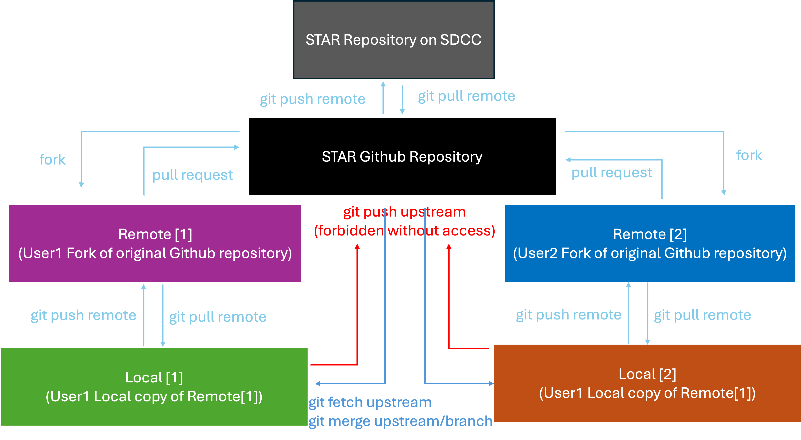
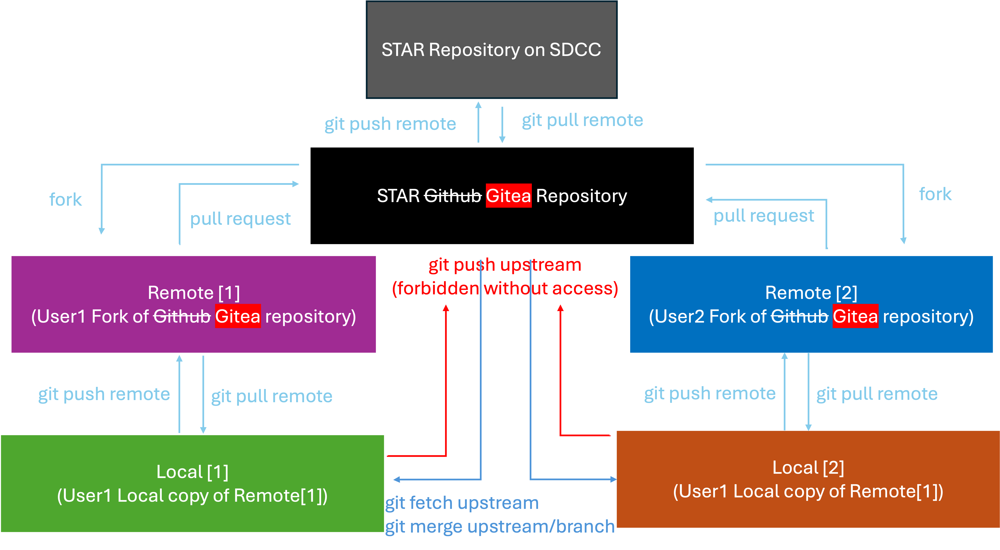
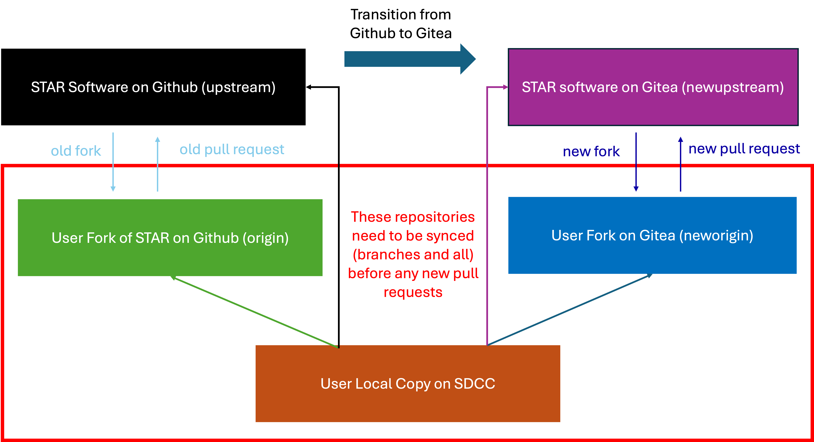

# Transitioning to Gitea

The transition of STAR repositories from GitHub to the Gitea service hosted by the SCDF at BNL has been discussed in S&C meetings since April. Bringing STAR repositories together in one place will provide a consistent and seamless environment for our software developers. It will make collaboration among STAR members easier, keep related STAR software together, and provide support from people familiar with STAR software, computing resources, and workflows.

At present, STAR repositories are fragmented between GitHub and Gitea. Gitea currently does not hold our offline core software. Consolidating them will also allow access to be managed consistently through STAR and BNL identities. All STAR users can access Gitea using their BNL credentials, while users who leave the collaboration will no longer retain the ability to modify STAR repositories (even those that are public). This is difficult to ensure on GitHub, where account identities and their relationship to current STAR membership are not always clear.

The transition is also important as RHIC enters its preservation era. With data taking ending and long term preservation becoming a central responsibility, STAR software and its development history must remain under reliable institutional stewardship. Placing our version control repositories at BNL is therefore both advisable and appropriate, since BNL will ultimately be responsible for preserving and maintaining these resources.

Due to the size of the STAR software (commits plus code) the built-in Github to Gitea migration is not possible so STAR code will be pushed directly to a new Gitea repository

## What is Gitea

Gitea is a tool to help create a hosting site for managing _git_ repositories. It is not a hosting site itself but software that lets you create your own hosting site. BNL Software and Computing Data Center (SDCC) has decided to utilize Gitea to setup a hosting site owned and managed by them. This will help ensure acess to STAR software as RHIC enters its shutdown phase. It will allow SDCC to host and preserve the STAR software indpendent of other hosting websites like Github where STAR software was previously being hosted. The much older version control system STAR used _CVS_ also required a host but that has been well documented elsewhere. The transition of STAR software from _CVS_ to _git_ means that Gitea needs to be used as we are managing _git_ repositories on the hosting site.

### Difference between Github and Gitea

Github is a hosting site for _git_ repositories and Gitea is a software that lets you create a hosting site for managing _git_ repositories. Therefore the workflow after the transition from Github to Gitea will stay the same. The only thing that changes is the hosting site which is the SDCC.

This means that you will __only__ have ssh access to the Gitea servers when logged into the SDCC nodes. The *https* URLs are still available from outside SDCC nodes but every git push and pull will require entering your SDCC credentials. This can be circumvented by setting up your git credentials but that will not be covered here.

## Using the new Gitea site

1. Go to https://git.racf.bnl.gov/gitea
   - You will be redirected to SDCC login page so use your SDCC credentials to login
2. After logging in you will see a similar interface to Github
3. Ensure you are part of the STAR Collaboration
   - If not check that you are in the STAR phonebook and that your SDCC account is linked to the phonebook
4. Check your settings for ssh keys
   - You should have an unremovable key by default created
	 - It is your usual SDCC ssh public key
	 - If you do not see a ssh key associated with your account make sure to add it on this setting page
   - This means you __must__ forward your ssh key when establishing a ssh connection to the SDCC nodes
      - This is easier if you have an ssh-agent running
5. That's it you can start working as you usually do with git

## Transitioning

Recall this picture of working with Github

Here is the picture of the workflow with Gitea

There is not much difference here and the only thing that changes is the host server as explained above. This means we need only to add the new remote repository URLs of our "Local copy of Remote" as seen in the diagram above.

(After forking from new STAR repository)
1. Go to https://git.racf.bnl.gov/gitea
2. Click on STAR software repository. Or click here [https://git.racf.bnl.gov/gitea/STAR/](https://git.racf.bnl.gov/gitea/STAR/)
3. Copy the SSH URL for the STAR software repository
4. Navigate to your local copy of the STAR repository `cd /my/path/to/star-sw`
5. Switch to the main branch `git checkout main`
   - You can safely add and commit any new code before switching to the main branch
6. Type `git remote -v` to see a list of the remote URLs linked to your repository
   - You will be adding a new remote URL so it should be different from any existing URLs
7. Type `git remote set-url newupstream newstarurl`
   - where `newupstream` is a name that doesn't exist in your current list of URLs
   - `newstarurl` is the SSH URL you copied in step (3)
8. Go back to the STAR software repository on Gitea from step (1) above
9. Click on the button to create a fork
10. Copy the SSH URL for the forked repository
11. Navigate to your local copy of the STAR repository
12. Switch to the main branch `git checkout main` if not already there
   - You can safely add and commit any new code before switching to the main branch
13. Type `git remote -v` to see a list of the remote URLs linked to your repository
   - You will be adding a new remote URL so it should be different from any existing URLs
14. Type `git remote set-url neworigin newforkurl`
   - where `neworigin` is a name that doesn't exist in your current list of URLs
   - `newforkurl` is the SSH URL you copied from your fork of the STAR repository in step (10)
   
If done correctly then you you will have something that looks like below

Now you need to sync everything so that your Github (origin) copy and your Gitea copy (neworigin) are identical and synced with your local copy on SDCC.

1. `git pull origin main` to sync your local copy with your Github copy
   - Repeat this for as many branhces as needed e.g. `git pull origin branchname`
2. `git pull neworigin main` to sync your local copy with your Gitea copy
   - If your github fork was synced with STAR code you shoud not have any merge conflicts and git will resolve the history
   - If you are having merge conflicts in the main branch you should make a separate branch where one branch contains your changes and the main branch keeps the code from the fork
   - Repeat for as many branches as needed
3. At this point your local copy should have all the changes you want to keep from your Github copy and any new changes coming from the STAR main repository as part of your fork. This means we just need to push the changes from our Github fork to our Gitea fork `git push neworigin main`
   - Repeat this push for any branches from Github you want to keep on Gitea `git push origin branchname`

Now the Github fork, Gitea fork and your local copy should all be in sync. Any branches you want to merge with STAR Gitea code should now be done as a pull request through Gitea website. If you want you can remove the Github URLs as you should not be pushing or pulling from them anymore. You can now work normally as before just using the new references and URLs.

